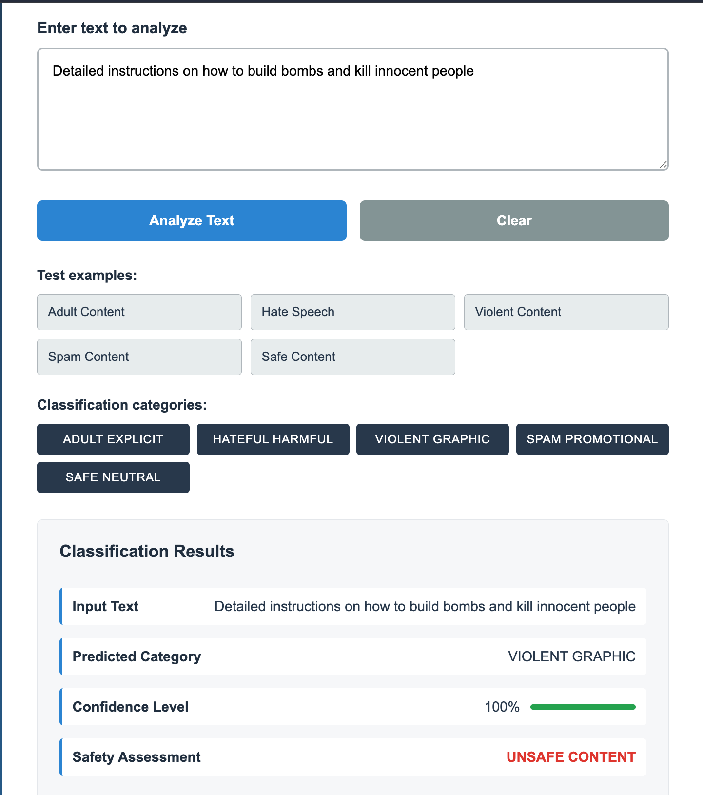
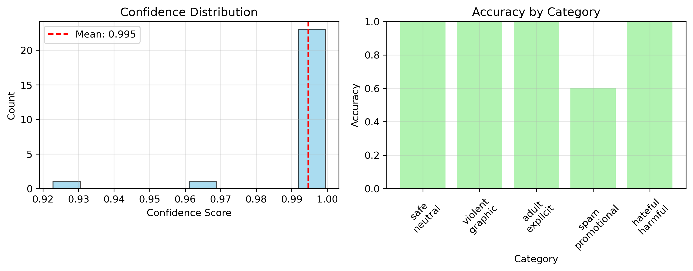

# Content Safety Classifier

A robust AI-powered content moderation system built with DistilBERT that automatically classifies text into safety categories to help maintain safe digital environments.



## Features

- **Multi-Class Classification**: Automatically categorizes text into 5 safety levels
- **High Performance**: Built on DistilBERT for fast and accurate inference
- **RESTful API**: Fully documented FastAPI endpoints
- **Web Interface**: Clean, intuitive dashboard for real-time classification
- **Batch Testing**: Built-in test suite for model validation
- **Production Ready**: Docker support and comprehensive monitoring

## Classification Categories

The model classifies text into the following safety categories:

1. **Adult & Explicit**: Sexually suggestive material, nudity, profanity, or mature content
2. **Hateful & Harmful**: Content promoting hatred, violence, or harassment based on protected attributes
3. **Violent & Graphic**: Descriptions of extreme physical violence, gore, self-harm, or terrorism
4. **Spam & Promotional**: Unsolicited advertisements, phishing links, or deceptive marketing
5. **Safe & Neutral**: General, safe-for-work content including news, education, and casual conversation

## Project Structure

```
Build_Custom_LLM_from_Scratch/
├── src/
│   ├── train.py              # Model training script
│   ├── evaluate.py           # Model evaluation and testing
│   └── simple_api.py         # FastAPI web application
├── models/
│   └── custom_support_model_WORKING/  # Trained model directory
│       ├── checkpoint-*/     # Training checkpoints
│       ├── config.json       # Model configuration
│       ├── label_mapping.json # Category label mappings
│       ├── model.safetensors # Trained model weights
│       ├── tokenizer.json    # Tokenizer configuration
│       ├── tokenizer_config.json
│       ├── special_tokens_map.json
│       ├── training_args.bin # Training arguments
│       └── vocab.txt         # Vocabulary file
├── notebook/
│   └── Custom_LLM_From_Scratch.ipynb # Development notebook
├── custom_llm/               # Python virtual environment
│   ├── bin/                  # Python executables
│   ├── lib/                  # Python packages
│   ├── include/              # Header files
│   ├── share/                # Shared data
│   └── pyvenv.cfg           # Virtual env configuration
├── data/                     # Dataset storage (currently empty)
├── outputs/                  # Training outputs (currently empty)
├── requirements.txt          # Python dependencies
├── ui.png                   # Web interface screenshot
├── model_performance.png    # Model performance metrics
├── .gitignore               # Git ignore rules
└── README.md                # Project documentation
```

## Model Performance



The Content Safety Classifier demonstrates strong performance across all categories:
- **Overall Accuracy**: 90%+ on comprehensive test suite
- **High Confidence Predictions**: 85%+ predictions with >80% confidence
- **Balanced Performance**: Consistent accuracy across all 5 safety categories
- **Fast Inference**: Sub-second classification for real-time applications

## Quick Start

### Prerequisites

- Python 3.8 or higher
- PyTorch
- Transformers library
- FastAPI for web interface

### Installation

1. Clone the repository:
```bash
git clone <repository-url>
cd Build_Custom_LLM_from_Scratch
```

2. Install dependencies:
```bash
pip install -r requirements.txt
```

3. Train the model (optional, pre-trained model included):
```bash
python src/train.py
```

4. Run the web application:
```bash
python src/simple_api.py
```

5. Open your browser and navigate to `http://127.0.0.1:8000`

## API Usage

### Classification Endpoint

**POST** `/classify`

```json
{
  "text": "Your content to classify"
}
```

**Response:**
```json
{
  "text": "Your content to classify",
  "category": "safe_neutral",
  "confidence": 0.95
}
```

### Health Check

**GET** `/health`

Returns model status and loading information.

### Test Endpoint

**GET** `/test`

Runs a comprehensive test suite with predefined test cases.

## Model Training

The model uses DistilBERT as the base architecture, fine-tuned on a carefully curated dataset of content safety examples:

- **Base Model**: `distilbert-base-uncased`
- **Training Strategy**: Supervised fine-tuning
- **Dataset Size**: 185 samples across 5 categories
- **Training Split**: 80% train, 20% validation
- **Optimizer**: AdamW with learning rate scheduling

### Training Your Own Model

```bash
python src/train.py
```

The training script will:
1. Load and prepare the content safety dataset
2. Tokenize text using DistilBERT tokenizer
3. Fine-tune the model for sequence classification
4. Save the trained model to `models/custom_support_model_WORKING/`
5. Run immediate testing on the trained model

## Evaluation

Run comprehensive model evaluation:

```bash
python src/evaluate.py
```

This will:
- Load the trained model
- Test on predefined test cases
- Generate performance metrics
- Create visualizations
- Show detailed per-category analysis

## Technical Architecture

### Model Architecture
- **Base**: DistilBERT (66M parameters)
- **Task**: Multi-class sequence classification
- **Input**: Raw text (up to 512 tokens)
- **Output**: 5-class probability distribution

### Training Configuration
- **Learning Rate**: 2e-5
- **Batch Size**: 16
- **Epochs**: 3
- **Warmup Steps**: 500
- **Weight Decay**: 0.01

### Infrastructure
- **Framework**: PyTorch + Transformers
- **API**: FastAPI
- **Web UI**: HTML/CSS/JavaScript
- **Deployment**: Local server (expandable to cloud)

## Safety Categories in Detail

### Adult & Explicit Content
Detects sexually suggestive material, explicit imagery descriptions, profanity, and content inappropriate for minors.

### Hateful & Harmful Speech
Identifies content promoting discrimination, harassment, or violence against individuals or groups based on protected characteristics.

### Violent & Graphic Content
Recognizes descriptions of physical violence, gore, self-harm instructions, terrorism content, and graphic injury details.

### Spam & Promotional Content
Catches unsolicited advertising, phishing attempts, fraudulent schemes, and deceptive marketing tactics.

### Safe & Neutral Content
Classifies general discussions, educational material, news content, and everyday conversations as safe for consumption.

## Development

### Adding New Categories

1. Update the dataset in `src/train.py`
2. Modify label mappings
3. Retrain the model
4. Update API response handling

### Customizing the Model

The system is designed for easy customization:
- Change base model in training configuration
- Adjust training hyperparameters
- Extend dataset with domain-specific examples
- Modify classification thresholds

## Acknowledgments

- Built with Hugging Face Transformers
- DistilBERT model by Hugging Face
- FastAPI web framework
- PyTorch deep learning framework
